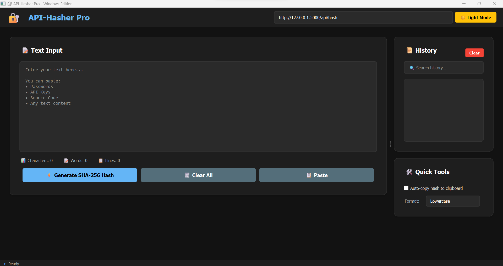

# API-Hasher

API-Hasher is a versatile application providing SHA-256 hash generation through multiple interfaces: a Flask-based web application and a native Windows desktop GUI.

## Features

*   **Web Interface:** A clean and responsive UI to manually input text and get its SHA-256 hash via your browser.
*   **API Endpoint:** A `/api/hash` endpoint for programmatic hash generation, suitable for integration with other services.
*   **Desktop GUI (Windows Edition):** A native desktop application built with PyQt6, offering an enhanced user experience with features like history, theme toggling, and direct API interaction from the GUI.
*   **SHA-256 Algorithm:** Uses the standard SHA-256 hashing algorithm for all operations.
*   **Responsive Design (Web):** The web interface is designed to work on various screen sizes.
*   **Error Handling:** Provides basic error messages for UI (web and desktop) and API interactions.

### User Interface Previews

**Web Application:**


**Desktop GUI (Windows Edition):**



## Prerequisites

*   Python 3.7+
*   pip (Python package installer)
*   Note: The Desktop GUI additionally requires `PyQt6` and `requests`, which are included in `requirements.txt`.

## Getting Started

Follow these instructions to get a copy of the project up and running on your local machine.

### 1. Clone the Repository

```bash
git clone https://github.com/moeindavarzani/API-Hasher.git
cd API-Hasher
```

### 2. Create and Activate a Virtual Environment (Recommended)

It's highly recommended to use a virtual environment to manage project dependencies.

**On macOS and Linux:**

```bash
python3 -m venv venv
source venv/bin/activate
```

**On Windows:**

```bash
python -m venv venv
.\venv\Scripts\activate
```

### 3. Install Dependencies

With the virtual environment activated, install the required packages using the `requirements.txt` file. This will install Flask for the web app, and PyQt6/requests for the desktop GUI.

```bash
pip install -r requirements.txt
```

### 4. Running the Applications

#### a. Web Application & API

To start the Flask web server (which also serves the API):

```bash
python app.py
```

The web application will start, typically on `http://127.0.0.1:5000/`. Open this URL in your web browser to access the UI. The API endpoint (`/api/hash`) will also be available at this address.

#### b. Desktop GUI (Windows Edition)

To run the native desktop application:

```bash
python desktop_gui/hasher_gui.py
```

This will launch the API-Hasher Pro desktop application. Ensure the Flask web application (`app.py`) is running if you want the desktop GUI to interact with the local API endpoint (default: `http://127.0.0.1:5000/api/hash`).

## Web Interface Usage

1.  Navigate to `http://127.0.0.1:5000/` in your browser.
2.  Enter the text or code you want to hash into the text area.
3.  Click the "Calculate Hash" button.
4.  The original text (if provided) and its SHA-256 hash will be displayed.
5.  You can use the "Copy" button to copy the hash to your clipboard.

## Desktop GUI Usage

1.  Run `desktop_gui/hasher_gui.py` as described in "Getting Started".
2.  The application provides a rich interface for text input.
3.  Use the "Generate SHA-256 Hash" button. The GUI will interact with the API (configurable, defaults to local Flask app).
4.  Results are displayed, and can be copied, saved to history, or compared.
5.  Additional features include theme toggling (Light/Dark), input statistics, history search, and hash formatting.

## API Usage

The application provides a RESTful API endpoint for generating hashes programmatically. This API is served by the Flask web application (`app.py`).

*   **Endpoint:** `/api/hash`
*   **Method:** `POST`
*   **Content-Type:** `application/json`

### Request Body

The request body must be a JSON object containing a `text` field:

```json
{
  "text": "Your string to hash"
}
```

### Example Request (using `curl`)

Assuming the Flask app is running on `http://127.0.0.1:5000/`:

```bash
curl -X POST -H "Content-Type: application/json" -d '{"text":"hello world"}' http://127.0.0.1:5000/api/hash
```

### Success Response (200 OK)

If successful, the API will return a JSON object with the original text and its SHA-256 hash:

```json
{
  "original_text": "hello world",
  "hashed_value": "b94d27b9934d3e08a52e52d7da7dabfac484efe37a5380ee9088f7ace2efcde9"
}
```

### Error Responses

*   **400 Bad Request:**
    *   If the request `Content-Type` is not `application/json`.
    *   If the JSON data is invalid or missing.
    *   If the `text` field is missing in the JSON data.
    *   If the `text` field is not a string.
    *   If the `text` field is empty or consists only of whitespace.
*   **500 Internal Server Error:**
    *   In case of an unexpected server-side error during hash calculation (rare).

## Project Structure

```
API-Hasher/
├── desktop_gui/        # Source code for the Desktop GUI (PyQt6)
│   └── hasher_gui.py
├── docs/
│   └── images/
│       ├── api_hasher_desktop.png
│       └── api_hasher_ui.png
├── app.py              # Main Flask application file (web app & API)
├── static/             # Static files (CSS, JavaScript) for web app
│   ├── script.js
│   └── style.css
├── templates/          # HTML templates for web app
│   └── index.html
├── .gitignore          # Specifies intentionally untracked files by Git
├── LICENSE             # Project license information
├── README.md           # This file
└── requirements.txt    # Project dependencies for both web and desktop apps
```

## Contributing

Contributions are welcome! If you have suggestions for improvements or find any issues, please feel free to open an issue or submit a pull request.

## License

This project is licensed under the MIT License - see the [LICENSE](LICENSE) file for details.